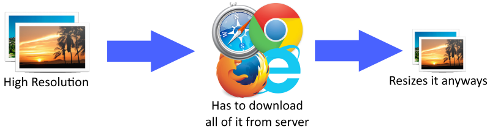

# PimpYoSite
Is your site slow and need to be pimped up?

## What it does
PimpYoSite is designed to take your website via URL and scan it for any oversize photos that can be resized to save space. 

Too many times new developers are not aware that they are slowing their website, wasting bandwidth, and more all in the name of having a 3840 x 2160, 4k resolution photo being resized by the browser to a 100 x 100 thumbnail.
